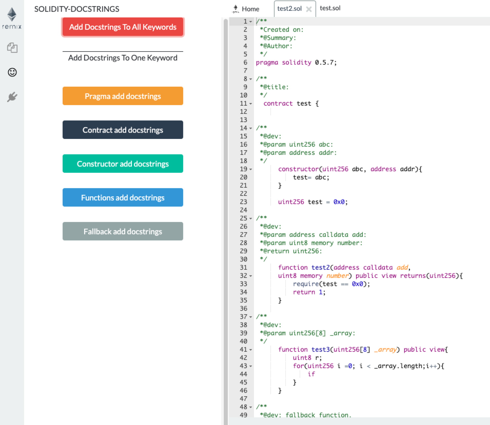
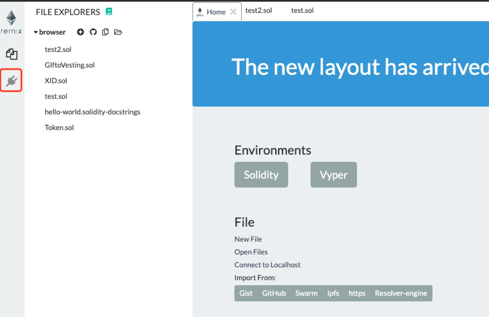
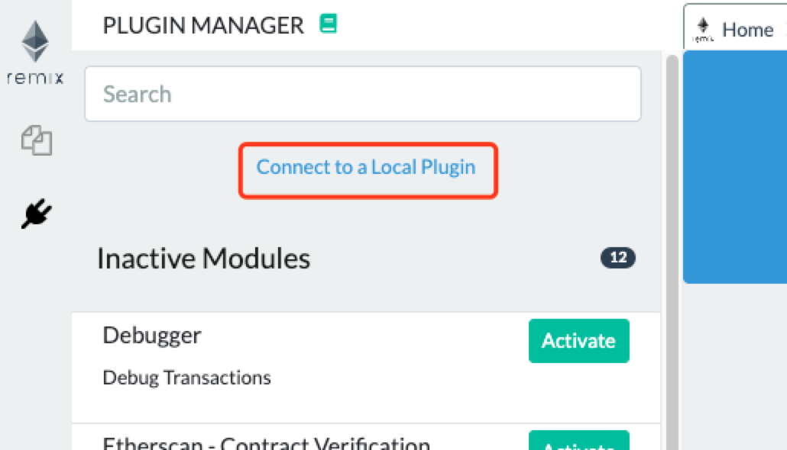
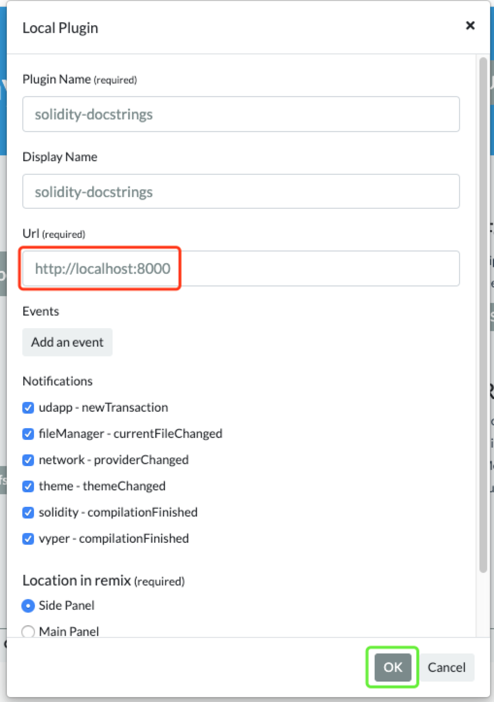
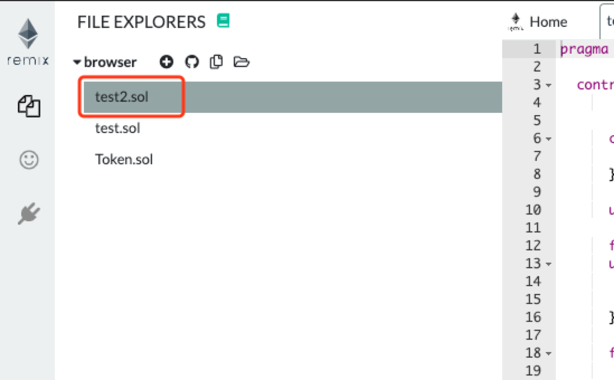
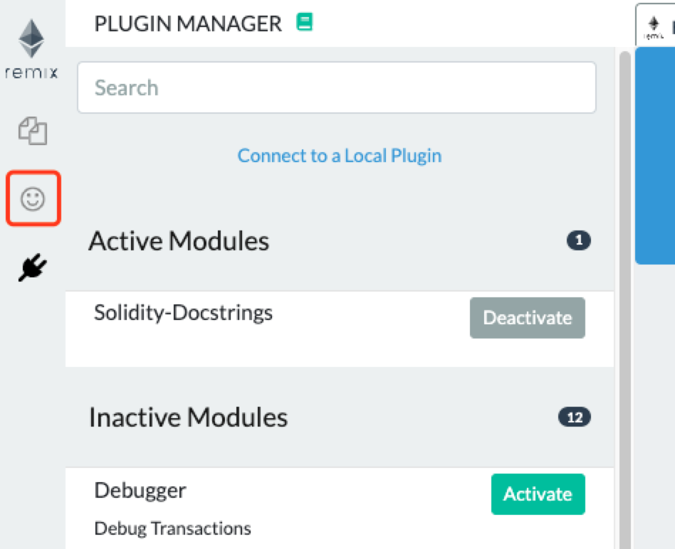
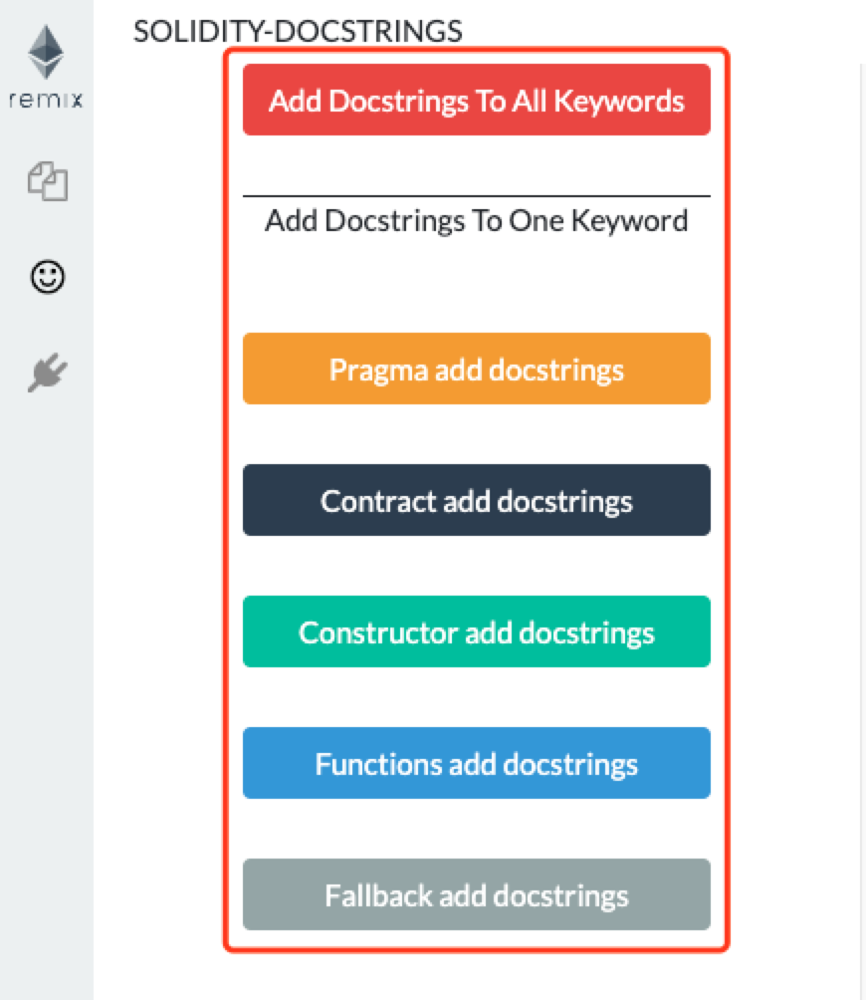

# Solidity Docstrings Remix-plugin

This plugin is developed for [Ethereum Remix online IDE](http://remix.ethereum.org/#optimize=false&evmVersion=null). 
You can get connection from this url https://solidity-docstrings-remix-plugin.netlify.com/  
Final effect:
 

# How to connect your Remix to the Plugin ?

step 1 click the button 
  
step 2 click "connect to a local plugin" (but actually we are connecting to an online port providing the plugin) 
  
step 3 give it a name and port(url) 
  
step 4 select a solidity file 
  
step 5 click the smile face on side panel 
  
step 6 click any button in the plugin and play with it 
  
