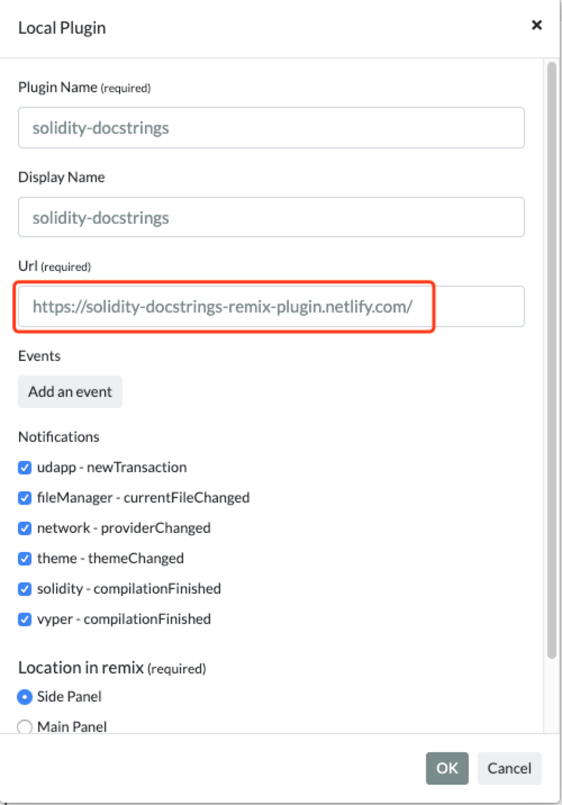

# Solidity Docstrings Remix-plugin

This plugin is developed for [Ethereum Remix online IDE](http://remix.ethereum.org/#optimize=false&evmVersion=null).
There is no way to publish it yet. You can only use it locally.
Final effect:


# How to Use

1. install locally

```
npm install
```

2. run it locally on port:8000

```
npm start
```

3. connect your Remix IDE to the Plugin
   step 1 click Button
   
   step 2 connect to local plugin
   
   step 3 give it a name and port
   
   step 4 select a solidity file
   
   step 5 click the smile face on side panel
   
   step 6 click any button in the plugin and play with it
   
